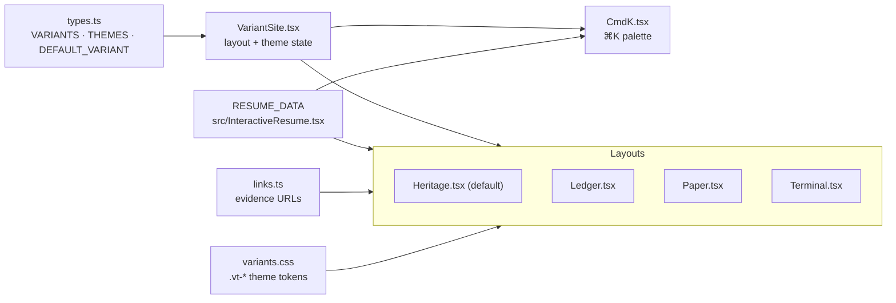
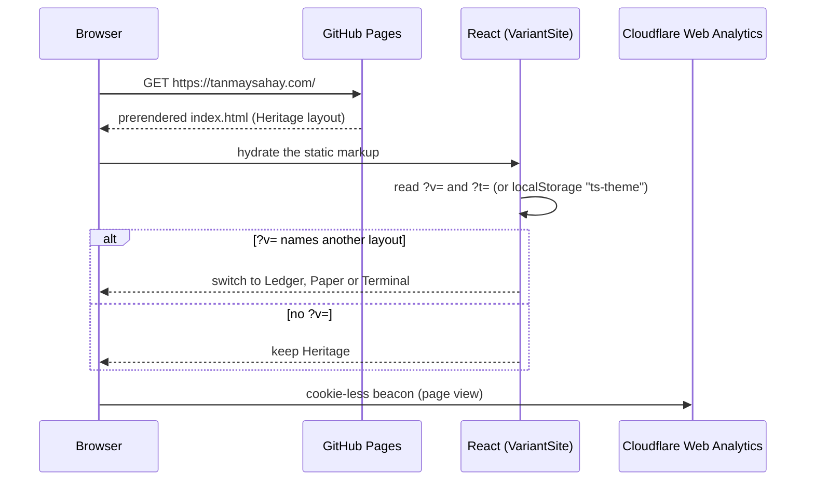
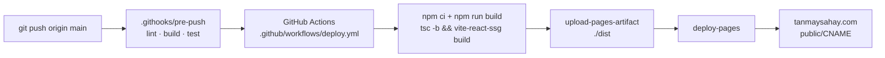

# tanmaysahay.com

[](https://github.com/tanmaysahay94/tanmaysahay94.github.io/actions/workflows/deploy.yml)

Source for **[tanmaysahay.com](https://tanmaysahay.com)**, a personal site and résumé. It is a static
React 19 + TypeScript + Vite app. **vite-react-ssg** prerenders it to plain HTML at build time, so
crawlers and link previews get real content, and the client hydrates it. GitHub Pages serves it.

## How it works, in five lines

1. All content lives in one object, `RESUME_DATA`, in `src/InteractiveResume.tsx`.
2. Four **layouts** (variants) render that same data: Heritage (the default), Ledger, Paper, and Terminal.
3. Eleven colour **themes** are an independent axis: CSS token classes (`.vt-*`) in `src/variants/variants.css`.
4. `src/variants/VariantSite.tsx` picks the layout (`?v=`) and the theme (`?t=` or `localStorage`).
5. A push to `main` runs the checks, builds the static site, and deploys it to GitHub Pages.

## Architecture



Every layout reads the same data, so one edit to `RESUME_DATA` updates all of them. Layout CSS uses
only `var(--token)` values; a raw hex colour outside a `.vt-*` block is a bug.

## What happens on a visit



The layout choice runs in `queueMicrotask`, not `requestAnimationFrame`, because browsers pause
animation frames in background tabs. Email addresses are never in the static HTML: buttons build the
`mailto:` link at click time.

## Build and deploy



There is no separate deploy command: every push to `main` deploys to production. Never use `gh-pages`
or force-push build output to `main`.

## Quickstart

Prerequisites: Node.js 22 and npm.

```bash
npm ci            # install; also points git at .githooks (the pre-push gate)
npm run dev       # Vite dev server with hot reload
npm run lint      # ESLint (TypeScript + React hooks rules)
npm test          # Vitest, single run
npm run build     # type-check, then prerender to ./dist
npm run preview   # serve ./dist locally
```

Open a specific layout or theme with query strings, for example `/?v=terminal` or `/?t=midnight`.

## Tests that guard the public site

| Test | What it fails on |
|---|---|
| `src/claims.test.ts` | Internal ticket IDs or `go/` links in `src/`, and retired product names in `src/`, `index.html` or `public/` |
| `src/variants/contrast.test.ts` | Any theme's text tokens below WCAG 4.5:1 contrast (finds every `.vt-*` block on its own) |
| `src/variants/variants.test.tsx` | A layout that loses the name, the evidence or the layout switcher; a role missing from a layout; an email address or phone number in the default layout's markup |
| `src/scramble.test.ts` | The click-to-reveal text scrambler |

## Directory map

```
src/
  InteractiveResume.tsx   RESUME_DATA (all content) + shared helpers
  main.tsx, App.tsx       vite-react-ssg entry → VariantSite
  variants/               the four layouts, theme tokens, ⌘K palette, links
public/                   CNAME, robots.txt, sitemap.xml, og-image.png, resume.pdf
index.html                meta, Open Graph, JSON-LD, analytics beacon
.github/workflows/        deploy.yml (GitHub Pages)
.githooks/pre-push        lint + build + test before every push
```
